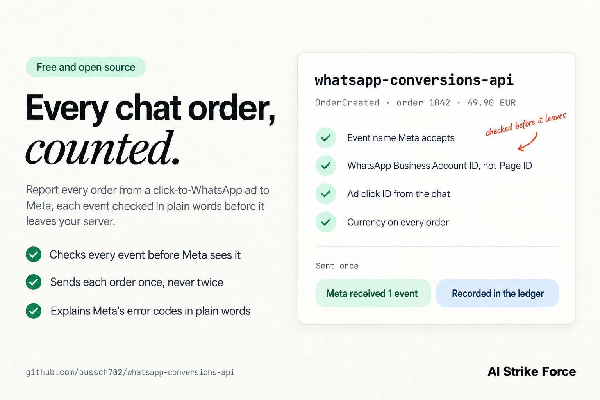

# whatsapp-conversions-api

[](https://github.com/oussch702/whatsapp-conversions-api/actions/workflows/test.yml)


[](LICENSE)



Send Meta Conversions API events for click-to-WhatsApp ads, and get them accepted the first time. It builds the exact business messaging payload, checks it in plain words before anything leaves your server, keeps a ledger so no order is counted twice, and explains Meta's error codes when something is still refused.

These events are what give click-to-WhatsApp ads access to purchase optimization, and they follow their own rules. They go to a dataset linked to your WhatsApp Business Account, not to your website pixel. They carry the WhatsApp Business Account ID, not the Page ID. Meta accepts a short list of event names, and Lead is not on it. We could not find the error subcodes these mistakes produce anywhere in Meta's public docs.

We run an AI sales agent on the official WhatsApp Cloud API for a cash-on-delivery store, and Meta had accepted none of its conversion events. Each fix unlocked the next error. The first was 2804066: Meta refused the event names, Lead included. Then 2804131, until the events went to the WhatsApp dataset with the WhatsApp Business Account ID in place of the Page ID. With that, the event for a real customer order was accepted. Two days later, an OrderCreated event without a currency came back with 2804081. This library checks for all three before anything is sent. The write-up, with what each code means and where each ID comes from: [WhatsApp Conversions API errors 2804066, 2804131 and 2804081: the fix for each](https://aistrikeforce.com/whatsapp-conversions-api).

## See it in under a minute

https://github.com/user-attachments/assets/ba793beb-a940-4833-84b5-e1f3b4a27c83

## Quick start

Check an event without sending it:

```bash
npx github:oussch702/whatsapp-conversions-api send --dry-run \
  --dataset YOUR_DATASET_ID \
  --waba YOUR_WABA_ID \
  --event OrderCreated \
  --ctwa-clid THE_AD_CLICK_ID \
  --order-id 1042 --value 49.90 --currency EUR
```

Remove `--dry-run` to send it, with the access token in `META_ACCESS_TOKEN` or in a file passed with `--token-file`. The event ID becomes `1042:OrderCreated`, and the ledger in `./capi-ledger.json` makes sure it goes out once.

Where each value comes from:

- **Dataset ID.** `POST /<waba-id>/dataset` on the Graph API returns the dataset linked to your WhatsApp Business Account, and creates one if there is none. It is not your website pixel.
- **WhatsApp Business Account ID.** The account your WhatsApp number belongs to. Not the Page ID, and not the phone number ID.
- **Ad click ID.** `referral.ctwa_clid` in the webhook of the message that came from the ad. Save it with the conversation, since the order comes later in the chat.
- **Access token.** It needs the `whatsapp_business_management` and `whatsapp_business_manage_events` permissions.

In your own code:

```js
import { buildEvent, openLedger, sendEvents } from 'whatsapp-conversions-api';

const event = buildEvent({
  eventName: 'Purchase',
  wabaId: process.env.META_WABA_ID,
  ctwaClid: conversation.referral.ctwa_clid, // saved when the chat started
  orderId: order.id, // the event ID becomes "<order id>:Purchase"
  value: order.total,
  currency: 'EUR',
  phone: conversation.waId, // optional, hashed with SHA-256 before it is sent
});

const { sent, skipped } = await sendEvents({
  datasetId: process.env.META_DATASET_ID,
  accessToken: process.env.META_ACCESS_TOKEN,
  events: [event],
  ledger: openLedger('capi-ledger.json'),
});
```

Install it with `npm install github:oussch702/whatsapp-conversions-api`. `sendEvents` resolves only when Meta confirms it received every event, with the IDs it sent and the ones the ledger held back. Anything else throws a `ConversionsApiError` that says why in plain words.

## What it does

- **Builds the payload** for a click-to-WhatsApp event: `action_source` set to `business_messaging`, `messaging_channel` set to `whatsapp`, the ad click ID and the WhatsApp Business Account ID in `user_data`, value and currency in `custom_data`, and a stable `event_id`. A phone number or email you pass is normalized and hashed with SHA-256 first.
- **Checks it before sending**, in plain words: an event name Meta refuses, a Page ID or dataset ID where the WhatsApp Business Account ID belongs, a missing or hashed click ID, a Purchase or OrderCreated without a currency, a value that is not a number, an `event_time` in milliseconds, in the future, or more than 7 days old. Meta rejects the whole request when one event is invalid, so one bad event costs all of them.
- **Treats "200 OK" with `events_received: 0` as a failure.** A 200 is not a receipt.
- **Sends each event once.** A JSON ledger marks an event ID before the request leaves and keeps it once Meta confirms. A retry, a crash or a replay a week later never counts an order twice.
- **Explains Meta's errors**: the three subcodes above, and the Graph API codes you can hit when sending events. Meta's own message is shown whole, because it can name the values Meta accepts.

| Function | What it does |
| --- | --- |
| `buildEvent(fields)` | The payload for one event. The event ID defaults to `<orderId>:<eventName>`. |
| `validateEvent(event, { datasetId, pageId })` | The problems in the event, each an `error` (Meta would refuse it) or a `warning`. Empty when the event is fine. |
| `sendEvents(options)` | Checks, sends and confirms. Options: `datasetId`, `accessToken`, `events`, `testEventCode`, `apiVersion`, `fetch`, `ledger`, `skipChecks`. |
| `explainError(codeOrResponse)` | The meaning and the fix for a code, a subcode, a Graph API error response or a `ConversionsApiError`. |
| `openLedger(file)` | The JSON file of event IDs already sent. |

## Example output

An example with made-up IDs: a file of four events, one of them correct.

```text
$ whatsapp-conversions-api validate events.jsonl
whatsapp-conversions-api · validate events.jsonl · 4 events

line 1  OrderCreated  1041:OrderCreated  ok
line 2  Lead  1042:Lead
  error    event_name  Meta refuses "Lead" for WhatsApp events (2804066). Use LeadSubmitted, or QualifiedLead once the lead is qualified.
line 3  OrderCreated  1043:OrderCreated
  error    custom_data.currency  OrderCreated needs custom_data.currency. The live API refused an OrderCreated event without one (2804081).
line 4  Purchase  1044:Purchase
  error    user_data.page_id  user_data has page_id but no whatsapp_business_account_id. Meta identifies WhatsApp events by the WhatsApp Business Account: with page_id, the live API answered 2804131.

3 of 4 events would be refused.
```

```text
$ whatsapp-conversions-api explain 2804131
subcode 2804131 · No Page associated to the dataset
  What it means: Meta cannot tie the event to your WhatsApp business. We got it when events went to the website pixel, and again on the WhatsApp dataset while user_data carried page_id instead of whatsapp_business_account_id.
  Fix: Send to the dataset linked to your WhatsApp Business Account (POST /<waba-id>/dataset returns its ID), and put whatsapp_business_account_id in user_data instead of page_id.
  Source: Seen on the live API in September 2026. We could not find it in Meta's public docs.
```

## Options

`send` builds one event, checks it and sends it. `validate <file>` checks a JSON Lines file, one event or one request body per line, and exits with code 1 when an event would be refused. `explain <code>` takes a code, a subcode, or a file holding Meta's error response.

| Option | What it does |
| --- | --- |
| `--dataset` | The dataset linked to your WhatsApp Business Account. Defaults to `META_DATASET_ID`. |
| `--waba` | The WhatsApp Business Account ID. Defaults to `META_WABA_ID`. |
| `--event` | The event name, such as `OrderCreated` or `Purchase`. |
| `--ctwa-clid` | The ad click ID from the webhook. |
| `--order-id` | Your order ID. The event ID becomes `<order-id>:<event>`. |
| `--event-id` | Your own stable event ID, for an event without an order. |
| `--value`, `--currency` | The amount, and its three-letter code such as `EUR`. |
| `--time` | When it happened, in Unix seconds or as an ISO date. Default: now. |
| `--phone`, `--email` | Customer details, normalized and hashed with SHA-256 before sending. |
| `--test-event-code` | The code from the Test Events tab in Events Manager. Meta's docs say test events still count for targeting and measurement, so the ledger records them too. |
| `--token-file` | A file holding the access token. Default: `META_ACCESS_TOKEN`. |
| `--ledger` | The ledger file. Default `./capi-ledger.json`. `--no-ledger` turns it off. |
| `--api-version` | Graph API version. Default `v25.0`, the version in Meta's current Conversions API examples. |
| `--skip-checks` | Send even when a check fails, for a rule Meta has changed since. |
| `--dry-run` | Print the payload and the checks, and send nothing. |

## Where the live API differs from the docs

The checks follow what the live API did, and say so when that is all there is to go on.

| Event names | What we know |
| --- | --- |
| `ViewContent`, `LeadSubmitted`, `QualifiedLead`, `AddToCart`, `InitiateCheckout`, `OrderCreated`, `OrderShipped`, `OrderDelivered`, `Purchase`, `OrderCanceled`, `OrderReturned` | Accepted by the live API when we tried names one by one. |
| `CartAbandoned`, `RatingProvided`, `ReviewProvided` | In Meta's docs, but we have not seen the live API accept them. A warning, not an error. |
| `Lead`, `Confirmed`, `Canceled` | Refused with 2804066. |

- **Currency.** Meta's docs require a currency on purchases. The live API also refused an OrderCreated event without one, with 2804081.
- **Customer details.** For WhatsApp, the business messaging docs list only the click ID and the WhatsApp Business Account ID. Meta's customer information parameters include a hashed phone (`ph`) and email (`em`), and the event the live API accepted carried a hashed phone. Both stay optional here.
- **Deduplication.** Our agent assumed Meta deduplicates within 48 hours, the window Meta documents for a pixel event paired with a server event. The business messaging docs go further: Meta does not deduplicate these events at all. The ledger has no time limit either way.
- **Error subcodes.** We could not find 2804066, 2804131 or 2804081 in Meta's public docs.

## Errors it explains

| Code | What it means | Fix |
| --- | --- | --- |
| 2804066 | The event name is not accepted for WhatsApp events | Use a name from the table above |
| 2804131 | No Page associated to the dataset | Send to the dataset linked to your WhatsApp Business Account, with `whatsapp_business_account_id` instead of `page_id` |
| 2804081 | Currency missing | Add `custom_data.currency` to every order event |
| 200 with `events_received: 0` | Meta took no event and did not say why | Nothing is recorded. Send it once with a test event code and watch Events Manager |
| 100 | Invalid parameter | Read the subcode and Meta's message |
| 102, 190 | Invalid or expired access token | Get a new token |
| 3, 10, 200–299 | A missing permission | `whatsapp_business_management` and `whatsapp_business_manage_events` |
| 1, 2, 4, 17, 341, 368 | Temporary problems, throttling or a temporary block | Wait, then send again |

The first four come from the live API. The others come from Meta's Graph API and Marketing API error references.

## What it cannot do

- **Tell whether a click ID is real.** Only Meta can. An order that did not start with an ad click has nothing to send, and that is not a failure.
- **Tell a Page ID from a WhatsApp Business Account ID by looking at it.** Both are plain numbers. It catches the mix-up when the event carries `page_id`, or when you give `validateEvent` your Page ID and dataset ID to compare.
- **Send Messenger or Instagram events.** They use other `user_data` fields.
- **Share its ledger between machines.** It is a JSON file for one process at a time. With several workers, keep the same rule in your database: a unique key on the event ID, written before the request leaves.
- **See what Meta does with an event after accepting it**, in attribution, in Events Manager or in your ads.

## FAQ

**What does error subcode 2804066 mean?**
Meta does not accept the event name for business messaging, and it refuses the whole request. Lead, Confirmed and Canceled are all refused. Use `LeadSubmitted` or `QualifiedLead` for leads, and `OrderCanceled` for cancellations.

**Where do I find the ctwa_clid?**
In the WhatsApp messages webhook, at `entry[].changes[].value.messages[].referral.ctwa_clid`, on the message that came from the ad. Meta leaves it out for ads shown in WhatsApp Status, and a conversation that did not start from an ad has none.

**Page ID or WhatsApp Business Account ID?**
The WhatsApp Business Account ID, in `user_data.whatsapp_business_account_id`. With `page_id`, the live API answered 2804131, and it accepted the event once it carried the WhatsApp Business Account ID instead.

**Can I send click-to-WhatsApp events to my website pixel?**
Only if it is linked to your WhatsApp business. Events sent to our website pixel came back with 2804131, "no Page associated to dataset". The simple route is `POST /<waba-id>/dataset`, which returns the dataset linked to your WhatsApp Business Account and creates one if there is none. Meta's docs also allow linking an existing dataset, one per Page.

**Meta answered 200. Why is my event missing?**
Check `events_received` in the response. Meta also answers 200 when it took no event, and this tool treats that as a failure and records nothing. To watch events arrive, send one with a test event code and open the Test Events tab in Events Manager.

**Does Meta deduplicate these events?**
Not for you. Meta's docs say it does not deduplicate business messaging events, and its 48-hour window only matches a pixel event with a server event. The ledger keeps every event ID it sent with no time limit, so an order replayed a week later still goes out once.

## Security

The access token is read from `META_ACCESS_TOKEN` or a file, sent only to graph.facebook.com in the Authorization header, and never printed or put in an error message. There is no `--token` option, so the token never lands in your shell history. Phone numbers and emails are hashed with SHA-256 before they leave your machine. The ledger holds event IDs, event names, times and Meta's trace IDs.

## Contributing

Issues and pull requests are welcome, especially an error code with the fix that worked. Run `npm test` before sending a change. The tests never call Meta: they run against a fake Graph API on localhost.

## License

MIT

---

Built by [AI Strike Force](https://aistrikeforce.com), an AI automation agency. We publish the tools and findings that come out of the systems we run.
